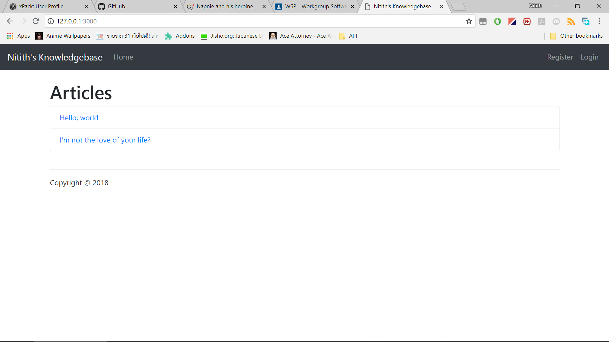
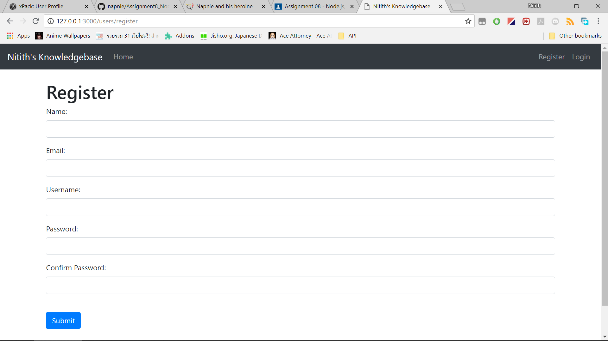
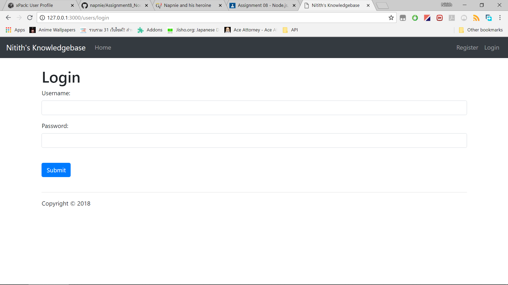
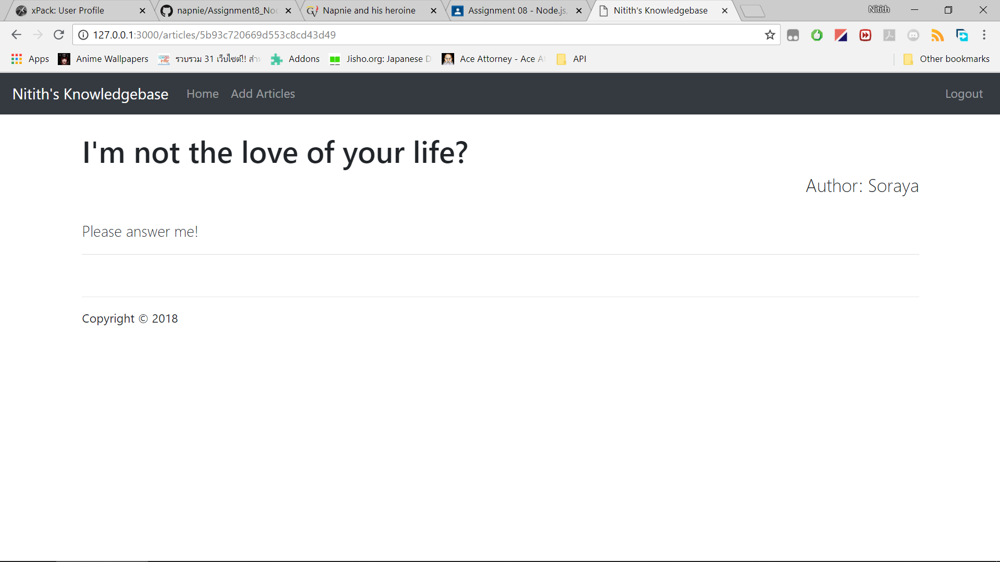
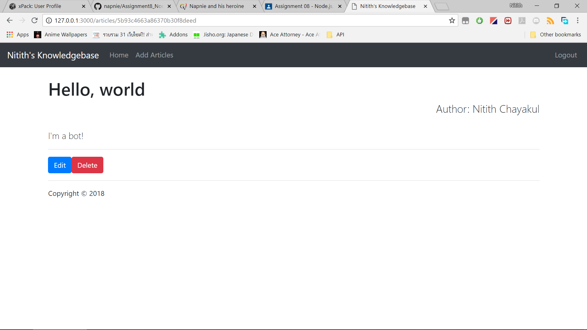
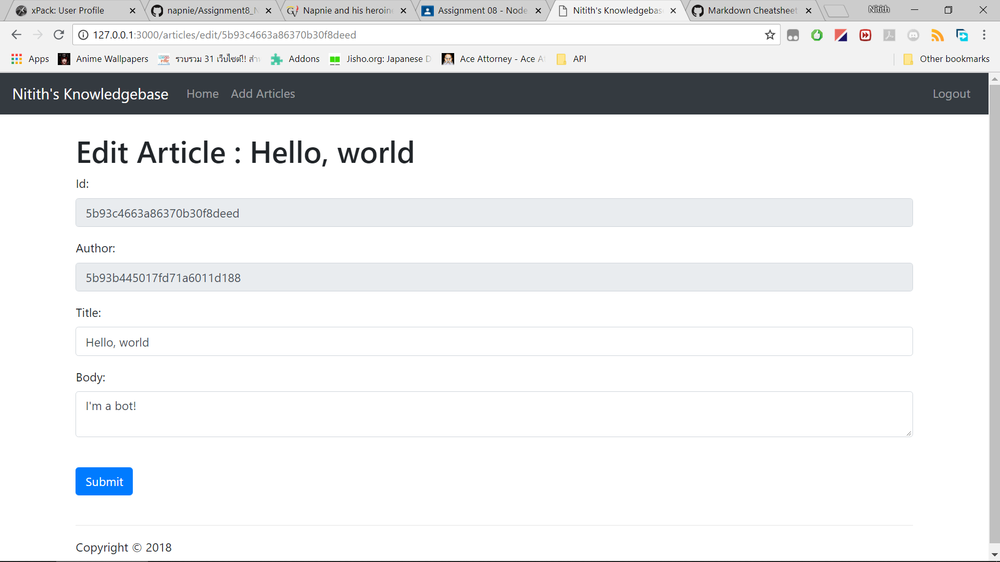
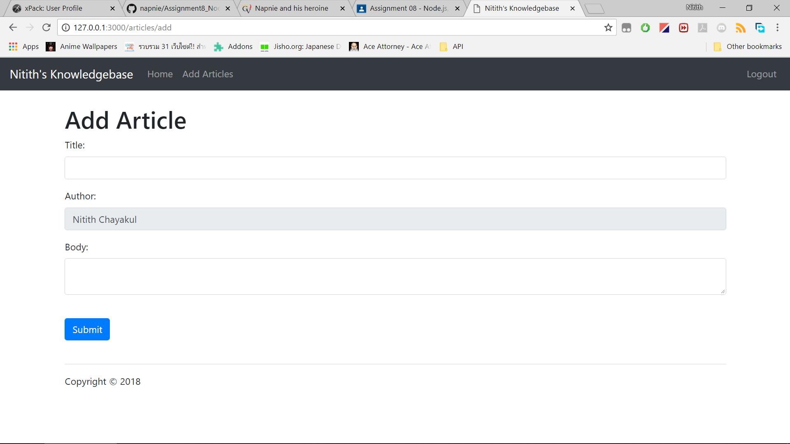

# Assignment 8 Node.js

Web application create using Node.js and MongoDB

#### by Nitith Chayakul

## Homepage

## Register

## Login

## Homepage after login

## Article

## Article after login

## Edit Article

## Add Artcle
